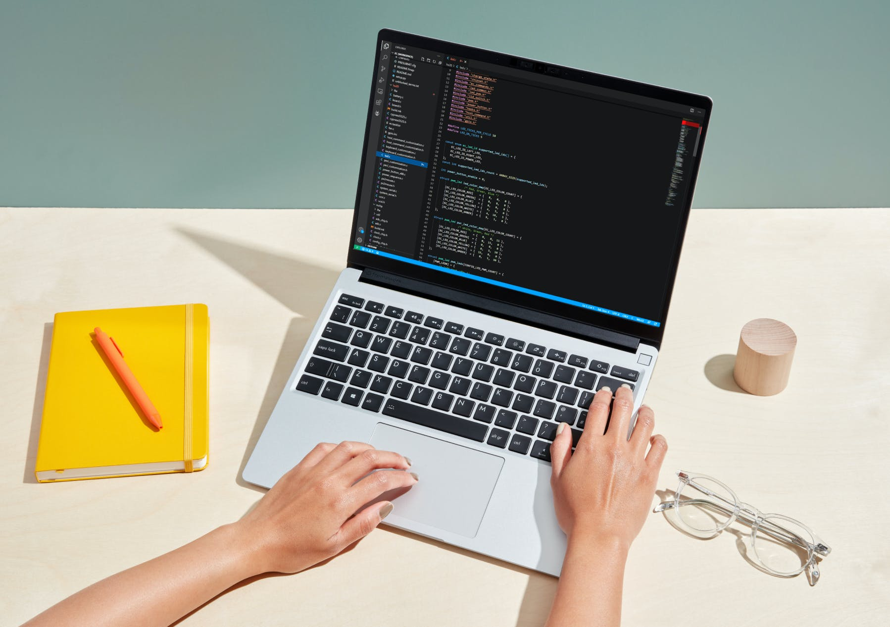

Even though I'm no longer a frequent flyer, I am still primarily a laptop user. Pre-pandemic, I bought a Lenovo Thinkpad X1 Carbon. It's a nice, lightweight machine has served me well until recently; the trackpad isn't as responsive as it once was, and some of the keys are showing their wear. For the price, it wasn't a bad investment to see me through a year and a half.

I've been keeping an eye on a few niche computer manufacturers with an emphasis on Linux: System76 (I already own one of their desktop computers) and Purism, who make security-conscious hardware. A new contender recently entered the playing field, though: Framework.

Several months ago, I first read about the Framework. Founded in San Francisco, California (USA) in 2019, their [mission](https://frame.work/ca/en/blog/introducing-the-framework-laptop) is to "empower you with great products you can easily customize, upgrade, and repair, increasing longevity and reducing e-waste in the process."

Their first product is a modular laptop, designed to make it easy to replace or upgrade any component with minimal fuss. The guiding light behind the project is the consumer's [right to repair](https://en.wikipedia.org/wiki/Electronics_right_to_repair); the principle that we have the right to upgrade or repair the electronics that we've purchased.

Most modern-day laptops tend to have their components soldered and glued in, making repairs difficult, time-consuming, and costly. So much so, in fact, that it's often more cost-effective to buy a new laptop than to repair a broken one. I have a stack of used laptops that have gone through that upgrade cycle.

With that in mind, I decided to take a serious look at the Framework laptop.

---

> A thin, lightweight, high-performance 13.5” notebook that can be upgraded, customized, and repaired in ways that no other notebook can.

The laptop comes with four expansion slots, two on either side of the body. You can buy expansion cards for USB-A, USB-C, HDMI, DisplayPort, MicroSD, and additional storage. Framework has released [reference designs and documentation](https://github.com/FrameworkComputer/ExpansionCards) so that anyone with the tools and know-how can create Expansion Cards. This will help to foster a community of makers to build new cards.

They're even [funding $100,000](https://frame.work/ca/en/blog/expansion-card-developer-program--canada-launch) worth of grants, discounts, and hardware over the next year to encourage Expansion Card developers to get involved.

Inside, all of the components are modular and easily replaced with the included screwdriver, from the mainboard (CPU) and keyboard to the wifi card and magnetically attached bezel on your display. Each component is tagged with a scanable QR code that will link you right to the documentation and repair guide. If something breaks, you can repair or replace it. The plan is to eventually release new mainboards, for example, to upgrade to a new CPU -- including ARM.

---

At this point, I was sitting on the fence but two things pushed me into action. The first was a review from [Cory Doctorow](https://doctorow.medium.com/the-framework-is-the-most-exciting-laptop-ive-ever-used-5415da0a46e5), after a month with his Framework laptop:

> Based on a month’s use, I am prepared to declare myself a Framework loyalist, and to retire my last Thinkpad…forever.

That's a pretty strong recommendation from someone of Cory's calibre.

A week later, I watched a hands-on review from [Linus Tech Tips](https://www.youtube.com/watch?v=0rkTgPt3M4k). 
---

At this point, I'm pretty excited by the prospects of what Framework has to offer.

With any new product, there's risk involved. Do they have the expertise to deliver on their promise? Will their be enough adoption to sustain the company? Time will tell.

Their founder has a long history in hardware and software development, ranging from the One Laptop Per Child project to Apple to the Oculus VR headset. That bodes well.

Long-term viability likely requires a diverse portfolio of products. The forthcoming Marketplace, where replacement parts and Expansion Cards will be sold, will be a good first step in that direction. Following their community forum, I've already seen prototype cards that are a sign that there *is* engagement with the right people.

The worst case, though, is that the company folds within a few years. By that time, though, I'll have gotten my money's worth.
---

## Concerns

3:2 display

BIOS

BIOS -> disconnect battery

## Pulling the trigger

The Framework laptop comes in two flavours: fully assembled or DIY, where you're sent the components and you put it together yourself at a savings of $300.
