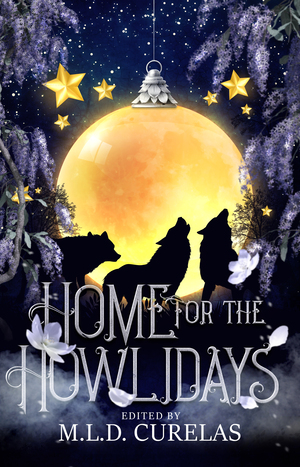

I'm a _bit_ late in announcing this, but I'm delighted to report that I sold a new story last year, to the anthology [Home for the Howlidays](https://tychebooks.com/howlidays).

> Celebrate the joys of togetherness during the holiday season with your friends, your family … and your pack. Let’s face it, whether you’re facing awkward family dinners, supernatural brawls, or the terrors of online dating, your pack always has your back.

     
    <a href="https://tychebooks.com/howlidays">Home for the Howlidays 
  Edited by M.L.D. Curelas</a>

Table of Contents:

- "A Furtastic Gathering" - Angèle Gougeon
- "Yule Moon" - Sarah Hersman
- "Two Loyal Dogs (And a Hornhead in an Apple Tree!)" - Rhonda Parrish
- "Playing the Odds" - JB Riley
- "The Curse of the Christmas Present" - Louis B. Rosenberg
- "Rex Invictus" - Robert W. Easton
- "O Howly Night" - Jennifer Lee Rossman
- "Where the Hearth Is" - Lisa Timpf
- "All Bark" - Rachel Sharp
- "Corn Dogs" - Sarah L. Johnson & Robert Bose
- "Twelve Days of Dating" - Krista D. Ball
- "The Yule Wolf" - Rebecca M. Senese
- "Bark! The Harold Angels Sing" - Lizz Donnelly
- **"In Anticipation of Their First Transformation" - Adam Israel**
- "The Dead Tree Gift" - E.C. Bell
- "The Wolf You Feed" - Melanie Marttila
- "Apple Night" - J. Y. T. Kennedy
- "The Teeth Have It" - Rebecca Brae
- "Shifting Gears" - V. F. LeSann

Available now, wherever books and ebooks are sold or borrowed.