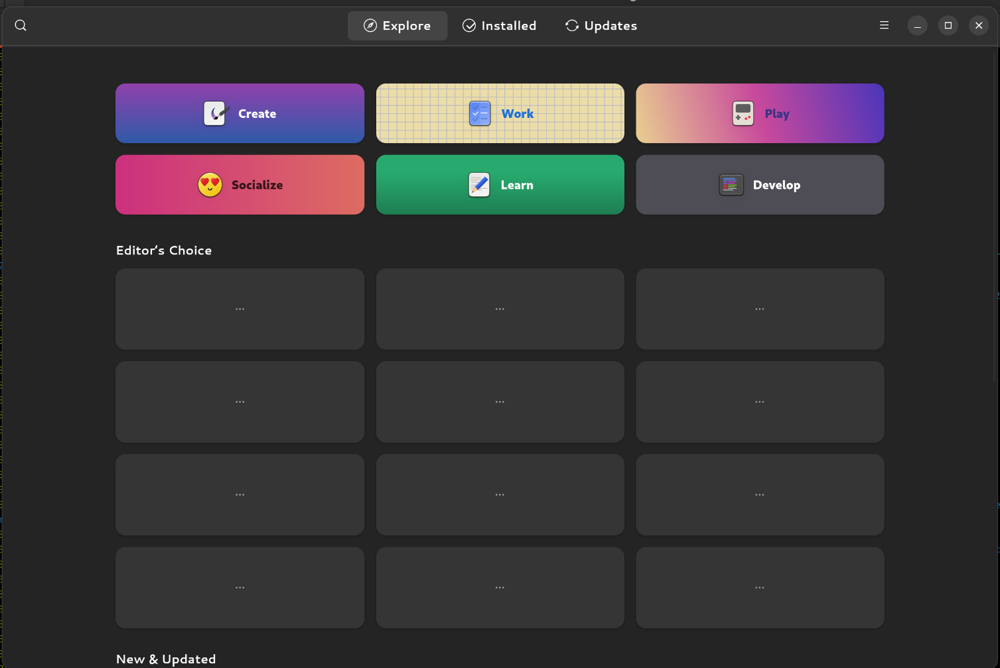
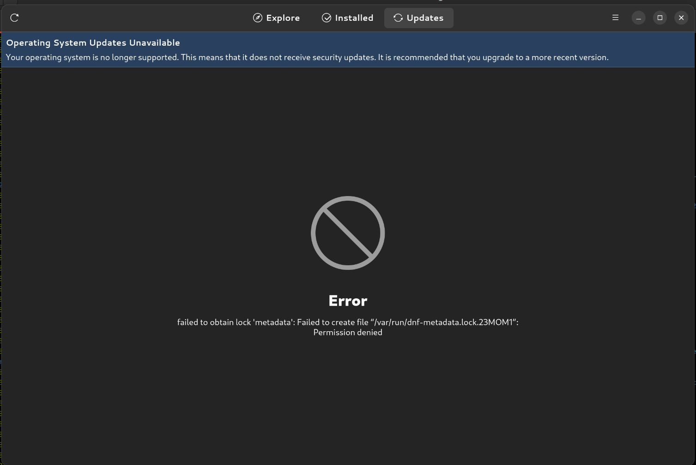

There have been a couple bugs in Fedora Silverblue 36 relating to [gnome-software](https://wiki.gnome.org/Apps/Software), both of which broke the ability to install. One of them was patched a few days ago but the second bug persists. I spent some time digging through the logs, and while I don't know enough about the internals of gnome-software to identify the exact root cause, I have found a workaround.





If you see the message "Operating System Updates Unavailable", followed by the error `failed to obtain lock 'metadata': Failed to create file “/var/run/dnf-metadata.lock.23MOM1”: Permission denied` then there's an easy solution.

Running `gnome-software --verbose`, I was able to capture the offending logs:

```
22:15:28:0679 librepo lr_handle_perform: Downloading/Locating yum repo
22:15:28:0679 librepo lr_yum_use_local: Locating repo..
22:15:28:0679 librepo lr_yum_use_local_load_base: Parsing repomd.xml
22:15:28:0711 librepo lr_gpg_check_signature_fd: signature verify error (no signatures)
22:15:28:0711 librepo lr_yum_use_local_load_base: repomd.xml GPG signature verification failed: Signature verify error - no signatures
22:15:28:0711 libdnf failed to check, attempting update: repodata tailscale-stable was not complete: repomd.xml GPG signature verification failed: Signature verify error - no signatures
22:15:28:0711 libdnf setting keyfile data for tailscale-stable
22:15:28:0711 libdnf Failed to remove /var/cache/rpm-ostree/repomd/tailscale-stable-36-x86_64.tmp: cannot open directory /var/cache/rpm-ostree/repomd/tailscale-stable-36-x86_64.tmp: Error opening directory “/var/cache/rpm-ostree/repomd/tailscale-stable-36-x86_64.tmp”: No such file or directory
22:15:28:0713 Gs  Setting I/O priority of thread 0x563f1d7bf000 to IDLE, 7
22:15:28:0714 Gs  failed to get recent apps: failed to obtain lock 'metadata': Failed to create file “/var/run/dnf-metadata.lock.YRASM1”: Permission denied
```

I don't know enough about libdnf or Fedora repository formats to know if it's a problem with the libdnf or the repository, but in this case my money is on libdnf being the culprit. The repo worked with `repo_gpgcheck` prior to upgrading to Silverblue 36.

In my case, I had manually added the repo for [Tailscale](https://tailscale.com/) to Silverblue by copying it to `/etc/yum.repos.d`. As it turns out, `repo_gpgcheck` is enabled in the Tailscale repo:

```
[tailscale-stable]
name=Tailscale stable
baseurl=https://pkgs.tailscale.com/stable/fedora/36/$basearch
enabled=1
type=rpm
repo_gpgcheck=1
gpgcheck=0
gpgkey=https://pkgs.tailscale.com/stable/fedora/36/repo.gpg
```

Normally, that would be a good thing. It enables GPG signature checking on the repodata. By default, this is disabled. In fact, what clued me in that there might be a problem is that `repo_gpgcheck` is disabled on all of the default Fedora repositories used by Silverblue. In scanning through various [forums](https://ask.fedoraproject.org/t/gnome-software-not-working-in-fedora-silverblue-36-with-your-operating-system-is-no-longer-supported-message/22115/25) and bug reports, both in [Silverblue](https://github.com/fedora-silverblue/issue-tracker/issues/257) and [upstream](https://bugzilla.redhat.com/show_bug.cgi?id=2083715), there are several different external repos that have been affected by this issue.


Check to see if you have any repos with `repo_gpgcheck` enabled:

```
$ grep "repo_gpgcheck=1" /etc/yum.repos.d/*                                       
/etc/yum.repos.d/tailscale.repo:repo_gpgcheck=1
```

Disable `repo_gpgcheck`:

```
sudo sed -i 's/repo_gpgcheck=1/repo_gpgcheck=0/' /etc/yum.repos.d/tailscale.repo
```

Next, clear and refresh the metadata cache:

```
rpm-ostree cleanup --repomd
rpm-ostree refresh-md
rm -rf ~/.cache/gnome-software
```

Now you should be able to run `gnome-software` and install/update your apps.
