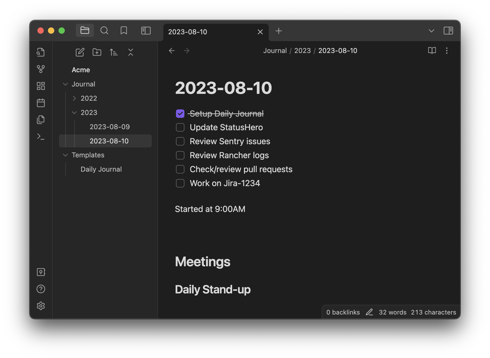
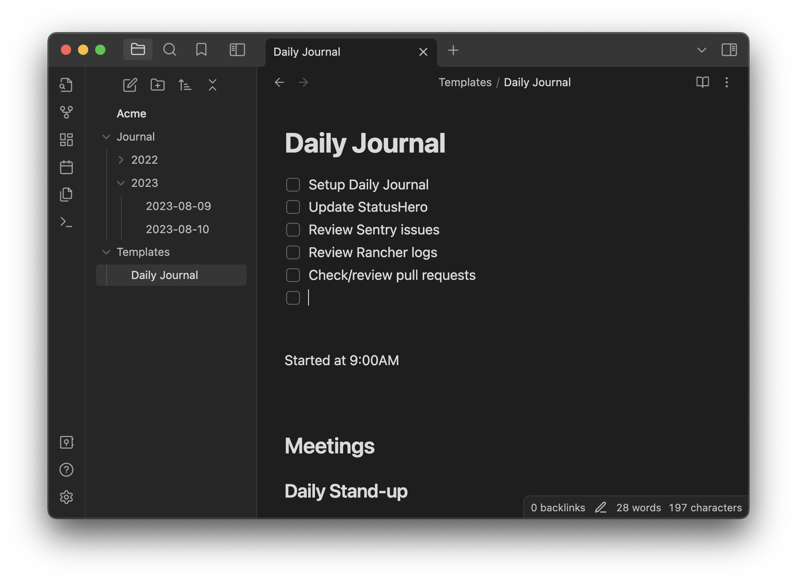
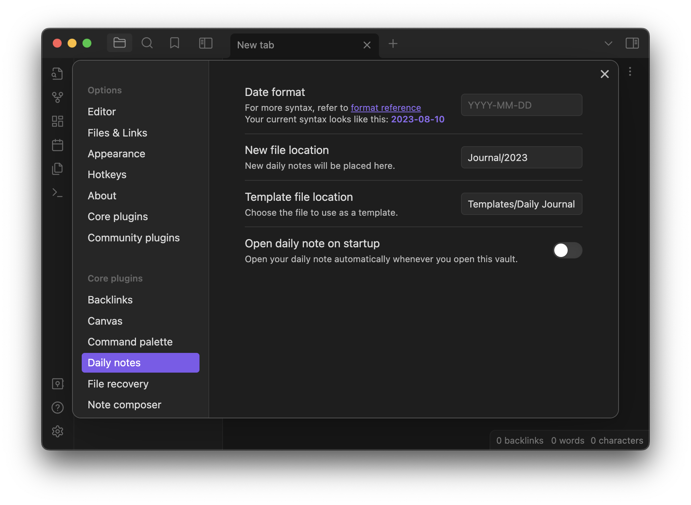

One habit I've gotten into over the past few years is to keep a daily journal for work. This is composed of an Obsidian vault with a few plugins (Daily Notes + Templates) enabled so that I can quickly create an entry and track my work for the day.

I've found that it helps to keep myself accountable -- at the start of the day, I review the previous days' work and create a bullet point list of work for the new day. Throughout the day, I keep a running commentary -- a sentence or two -- about what I'm working on, what I'm stuck on, and any interesting things I've discovered. I spend maybe 5-10 minutes/day doing this; not a major time commitment.

It's also come in handy when I need to refer back to something I worked on weeks or months ago. Instead of relying on memory, I can go back to see verbatim what I did on a given day.

Switch to Obsidian, click "Open today's daily note" from the sidebar, and dive right in.

--

First you'll need to download [Obsidian.md](https://obsidian.md/), a cross-platform application. Create a Vault for your work -- I save it in Dropbox so it syncs between laptop and desktop. The only caveat is the iOS application only supports Obsidian's sync service, so I live without it on the mobile.

Create a template for what you want your daily journal to look like. Mine looks something like this:

It starts with a basic list of tasks that I should perform every day, followed by things I need to work on today.

Next, setup the Daily Notes plugin, telling it where you want to create the note and which document to use as the template.

And that's it. I've been doing it for the past three years and it's one of the best habits I've picked up.